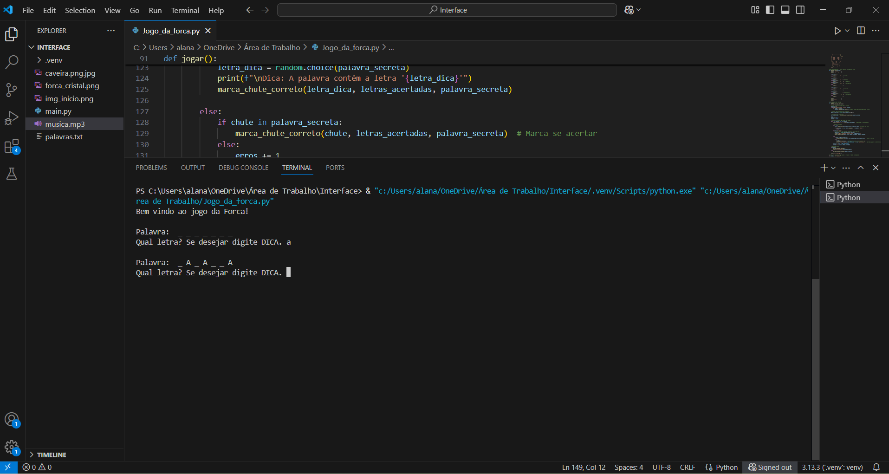

# readme-profissional

Esse projeto é um Jogo da Forca programado 100% em linguagem Python, que funciona no terminal próprio do VSCode ou em outra IDLE.  
“Projeto de exemplo com README profissional para o Neps Academy”

---

## 📘 Projeto Exemplo: README.md Profissional

Este projeto foi criado como parte do desafio do Neps Academy para construir um README.md profissional de um projeto hospedado no GitHub.  
Caso queira saber mais, aqui está o enunciado do projeto: https://neps.academy/br/project/17

---

## 🧭 Sumário
 
- [Instalação](#-instalação)  
- [Como Usar](#-como-usar)  
- [Contribuições](#-contribuições)  
- [Licença](#-licença)  
- [Contato](#-contato)  
- [Demonstração](#-demonstração)  

---

## 💻 Instalação

Não há necessidade de instalação, pois este projeto é apenas um exemplo de documentação.

Para rodar o jogo (se desejar testar):

1. Tenha o Python 3 instalado (versão 3.x).  
2. Baixe o arquivo `Jogo_da_forca.py`.  
3. Abra o terminal na pasta onde está o arquivo.  
4. Execute o comando: python Jogo_da_forca.py

---

## 🚀 Como Usar

Basta navegar pelos arquivos deste repositório para ver a estrutura de um projeto bem documentado.

Se quiser jogar o jogo da forca:

- Execute o script como indicado na seção de instalação.  
- Você verá uma palavra oculta representada por underlines (_ _ _ _).  
- Digite letras para tentar adivinhar a palavra.  
- Você tem até 7 tentativas erradas antes do jogo acabar.  
- Para pedir uma dica, digite `dica` durante o jogo; uma letra correta será revelada.  
- O jogo termina quando a palavra for descoberta ou as tentativas acabarem.

---

## 🤝 Contribuições

Contribuições são bem-vindas!  
Abra uma issue ou envie um pull request.

---

## 📄 Licença

Este projeto está licenciado sob a Licença MIT - veja o arquivo LICENSE para mais detalhes.

---

## 📬 Contato

Feito por BeeyWasser ✨  
Você pode me encontrar no Neps Academy!

---

## 🎮 Demonstração

